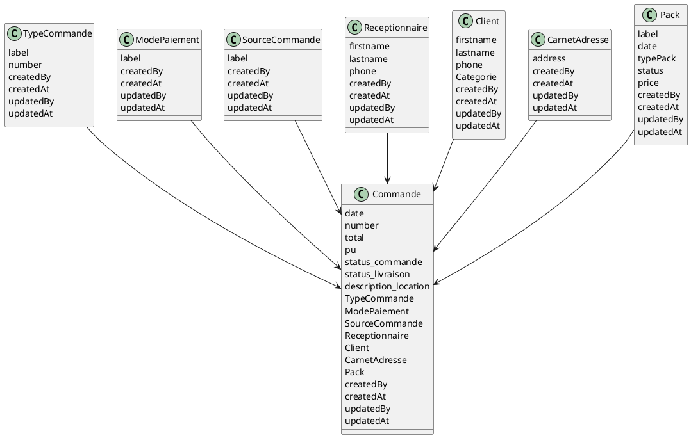

```plantuml

@startuml

class TypeCommande {
   label
   number
   createdBy
   createdAt
   updatedBy
   updatedAt
}

class ModePaiement {
   label
   createdBy
   createdAt
   updatedBy
   updatedAt
}

class SourceCommande {
   label
   createdBy
   createdAt
   updatedBy
   updatedAt
}

class Receptionnaire {
   firstname
   lastname
   phone
   createdBy
   createdAt
   updatedBy
   updatedAt
}

class Client {
   firstname
   lastname
   phone
   Categorie
   createdBy
   createdAt
   updatedBy
   updatedAt
}

class CarnetAdresse {
   address
   createdBy
   createdAt
   updatedBy
   updatedAt
}

class Pack {
   label
   date
   typePack
   status
   price
   createdBy
   createdAt
   updatedBy
   updatedAt
}

class Commande {
   date
   number
   total
   pu
   status_commande
   status_livraison
   description_location
   TypeCommande
   ModePaiement
   SourceCommande
   Receptionnaire
   Client
   CarnetAdresse
   Pack
   createdBy
   createdAt
   updatedBy
   updatedAt
}


TypeCommande  --> Commande
ModePaiement  --> Commande
SourceCommande  --> Commande
Receptionnaire  --> Commande
Client  --> Commande
CarnetAdresse  --> Commande
Pack  --> Commande
@enduml
```
