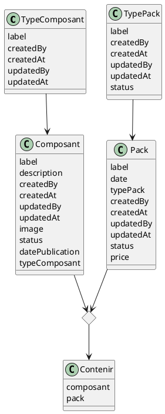

```plantuml

@startuml

class TypeComposant {
   label
   createdBy
   createdAt
   updatedBy
   updatedAt
}

class Composant {
   label
   description
   createdBy
   createdAt
   updatedBy
   updatedAt
   image
   status
   datePublication
   typeComposant
}

class Pack {
   label
   date
   typePack
   createdBy
   createdAt
   updatedBy
   updatedAt
   status
   price
}

class TypePack {
   label
   createdBy
   createdAt
   updatedBy
   updatedAt
   status
}

class Contenir {
   composant
   pack
}


diamond dia


TypeComposant  --> Composant
Composant  --> dia
TypePack  --> Pack
Pack  --> dia
dia --> Contenir
@enduml
```
